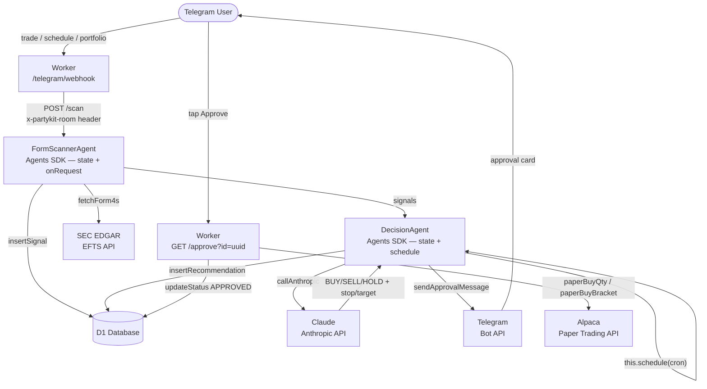

# Insider Signal Trader

An automated insider-signal paper trader built on the **Cloudflare Agents SDK**. It monitors SEC EDGAR Form 4 filings daily, scores open-market insider purchases, asks Claude (Anthropic) for a trading decision, and sends you a Telegram approval card. One tap places a bracket order on Alpaca paper trading.

The pipeline schedule is fully user-controlled from Telegram — no static cron required.

---

## How it works



**Pipeline steps:**

1. `FormScannerAgent` fetches Form 4 filings from SEC EDGAR (1-day lookback, falls back to 3 days if no purchases), scores each open-market purchase on role, dollar value, cluster buys, and recency, then writes the top 10 signals to D1.
2. `DecisionAgent` calls Claude with the signals + live portfolio context and receives structured BUY/SELL/HOLD decisions including stop-loss and take-profit prices.
3. Each actionable decision is written to D1 as a `PENDING` recommendation and sent to Telegram as an approval card with **Approve** / **Reject** inline buttons.
4. Tapping **Approve** hits `GET /approve?id=<uuid>` on the Worker, which fetches the current price, calculates whole-share quantity, and places a bracket order (or plain market order) on Alpaca.

---

## Built on the Cloudflare Agents SDK

Both stateful services extend `Agent` from `@cloudflare/agents` — Durable Objects with embedded SQLite, typed state, and a built-in scheduler:

### `FormScannerAgent extends Agent<Env, FormScannerState>`
*`src/agents/formScanner.ts`*

- Persists `lastScannedAt` and `pendingSignalIds` across requests via `this.setState()`
- Handles `POST /scan` via `onRequest()` — no manual fetch dispatch needed

### `DecisionAgent extends Agent<Env, DecisionState>`
*`src/agents/decision.ts`*

- Persists `pendingRecommendationIds` — UUIDs of recommendations still awaiting Telegram approval
- **`this.schedule(cronExpr, "runPipelineFromScheduler", {})`** — the user's chosen schedule is stored in Agent SQLite and **survives deploys and restarts**
- **`this.schedule(expirySeconds, "expireRecommendation", { id })`** — auto-expires unapproved cards after 23 hours
- `runPipelineFromScheduler()` — the scheduled callback that orchestrates the full scan → decide → notify pipeline

**Key distinction:** The Agents SDK provides the stateful runtime (persistent state, scheduling, Durable Object lifecycle). Claude (Anthropic) is the external reasoning model used only for LLM inference — it could be swapped for Workers AI with minimal changes.

```toml
# wrangler.toml — Agents SDK requires new_sqlite_classes (not new_classes)
[[migrations]]
tag = "v1"
new_sqlite_classes = ["FormScannerAgent", "DecisionAgent"]
```

### Why Agents SDK vs plain Durable Objects

| Concern | Plain Durable Object | Agents SDK (`@cloudflare/agents`) |
|---|---|---|
| Persistent state | `ctx.storage.get/put` (key-value) | `this.setState()` / `this.state` (typed object, SQLite-backed) |
| Scheduling | External cron in `wrangler.toml` | `this.schedule(cron\|delay\|date, method, payload)` — stored in Agent SQLite |
| HTTP routing | Manual `fetch()` dispatch | `onRequest()` with automatic routing |
| WebSockets | Manual `acceptWebSocket()` | `onConnect()` / `onMessage()` built in |

---

## Prerequisites

- [Cloudflare account](https://dash.cloudflare.com/sign-up) (free tier works)
- [Alpaca Markets account](https://alpaca.markets/) — paper trading, free
- [Anthropic API key](https://console.anthropic.com/)
- [Telegram bot](https://t.me/BotFather) created via @BotFather
- Node.js 18+ and `npm`
- [Wrangler CLI](https://developers.cloudflare.com/workers/wrangler/install-and-update/) — `npm install -g wrangler`
- [GitHub CLI](https://cli.github.com/) — optional, for one-command push

---

## Setup

### 1. Clone and install

```bash
git clone https://github.com/<you>/insider-signal-trader
cd insider-signal-trader
npm install
```

### 2. Authenticate Wrangler

```bash
npx wrangler login
```

### 3. Create the D1 database

```bash
npx wrangler d1 create insider-trader
```

Copy the `database_id` output into `wrangler.toml` under `[[d1_databases]]`, then run the schema migrations:

```bash
npx wrangler d1 execute insider-trader --remote --file=db/schema.sql
npx wrangler d1 execute insider-trader --remote --file=db/migrations/v2_stop_limit.sql
```

### 4. Set secrets

Secrets are stored encrypted in Cloudflare — they are never in your code or `wrangler.toml`:

```bash
npx wrangler secret put ALPACA_API_KEY
npx wrangler secret put ALPACA_SECRET_KEY
npx wrangler secret put ANTHROPIC_API_KEY
npx wrangler secret put TELEGRAM_BOT_TOKEN
npx wrangler secret put TELEGRAM_CHAT_ID
```

### 5. Update `wrangler.toml`

Fill in your Worker's subdomain for the approval deep-link:

```toml
[vars]
APPROVAL_BASE_URL = "https://insider-signal-trader.<your-subdomain>.workers.dev"
```

### 6. Deploy

```bash
npm run deploy
```

### 7. Register the Telegram webhook (one-time)

Open this URL in your browser after deploying:

```
https://insider-signal-trader.<your-subdomain>.workers.dev/telegram/setup
```

You should see `{"ok":true}`. Telegram will now forward all bot messages to your Worker.

### 8. Schedule the daily scan from Telegram

Open your Telegram bot and send:

```
schedule 6:30 PM weekdays
```

The `DecisionAgent` converts this to a UTC cron expression, stores it in its embedded SQLite via `this.schedule()`, and responds with a confirmation. The schedule persists across deploys.

---

## Local development

```bash
cp .dev.vars.example .dev.vars
# Fill in your credentials in .dev.vars
npm run dev
```

> **Note:** Durable Objects (and therefore Agents) run in the local Miniflare environment. The `.dev.vars` file is loaded automatically by Wrangler and is excluded from git.

---

## Telegram command reference

| Command | Action |
|---|---|
| `trade` | Run the full pipeline immediately |
| `portfolio` | Show live Alpaca account balance + positions |
| `schedule 6:30 PM weekdays` | Set a recurring scan time (CST, converted to UTC cron) |
| `when` | Show the current schedule and next run time |
| `cancel schedule` | Remove the recurring schedule |

Typos are handled — e.g. `portofolio`, `/portfolio`, `positions` all trigger the portfolio command.

---

## Project structure

```
src/
  index.ts              # Worker entry point — Telegram webhook handler, request routing
  agents/
    formScanner.ts      # Agents SDK — EDGAR fetch → score → D1
    decision.ts         # Agents SDK — Claude LLM, this.schedule(), Telegram cards
  routes/
    approval.ts         # GET /approve and /reject handlers → Alpaca
  tools/
    alpaca.ts           # Alpaca REST API wrapper (paperBuyQty, paperBuyBracket)
    edgar.ts            # SEC EDGAR EFTS fetch + XML parser
    scoring.ts          # Multi-factor signal scoring model
    telegram.ts         # Telegram Bot API wrapper
    db.ts               # D1 query helpers
  types.ts              # Shared TypeScript interfaces
db/
  schema.sql            # Initial D1 schema
  migrations/           # Incremental schema changes
scripts/
  test-approval.ts      # End-to-end approval smoke test
  test-telegram.ts      # Telegram card smoke test
  test-live-flow.ts     # Seeds D1 + sends a real live approval card to Telegram
wrangler.toml           # Cloudflare Worker + Agents SDK (new_sqlite_classes) config
.dev.vars.example       # Template for local environment variables
```

---

## Running tests

```bash
npm run test:telegram    # Send a test Telegram approval card
npm run test:approval    # Full approve → Alpaca order end-to-end test
npm run test:live        # Seed D1 + send a real approval card (click in Telegram to complete)
```

---

## Security notes

- **Never commit `.dev.vars`** — it is listed in `.gitignore`
- All production secrets are managed via `wrangler secret put` and stored encrypted in Cloudflare
- The Alpaca configuration defaults to `paper-api.alpaca.markets` (paper trading only)
- Approval deep-links are single-use UUIDs tied to a specific recommendation in D1
